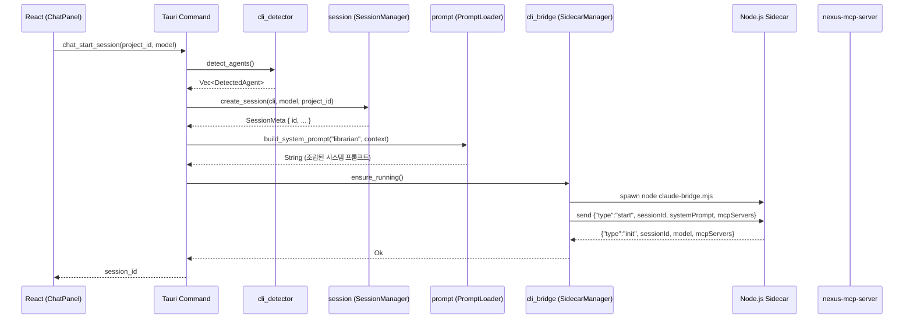
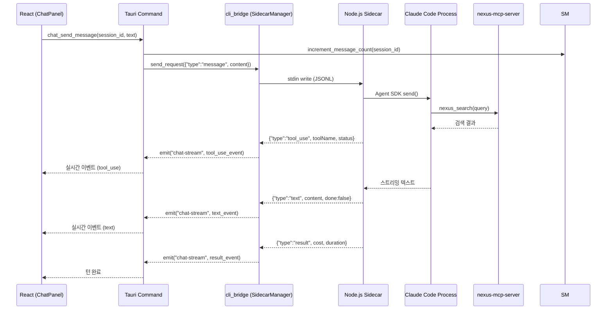
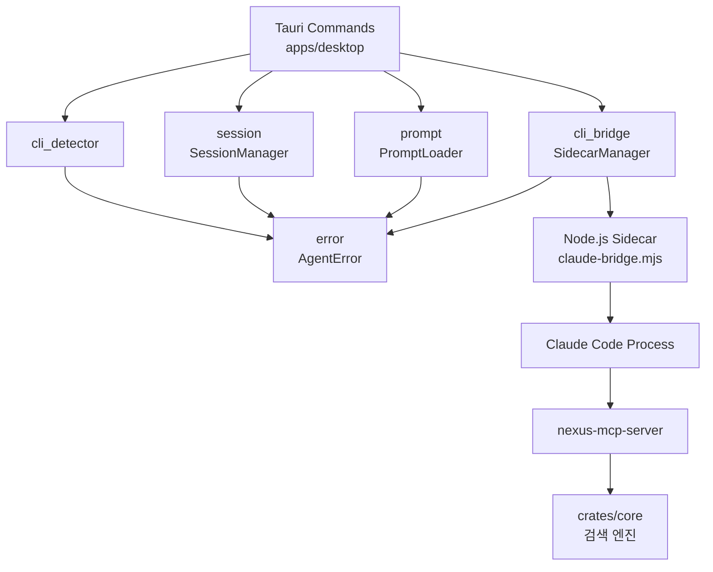

<!-- docsmith: auto-generated 2026-03-23 -->

# 사서 에이전트 아키텍처

## 1. 개요

사서 에이전트(Librarian Agent)는 obsidian-nexus 데스크톱 앱에 내장된 AI 보조 기능이다. 사용자가 자연어로 질문하면 에이전트가 nexus 검색 엔진을 활용해 문서를 찾아주고, 요약·분석·유지보수 제안까지 수행한다.

### 목적

- FTS5 키워드 검색의 진입 장벽을 낮추고 자연어 질문으로 정보 접근 가능하게 함
- 하이브리드 검색, 백링크 그래프, 태그 필터링을 에이전트가 자동 조합
- 질문 → 검색 → 열람 → 작업이 하나의 앱에서 완결되는 통합 UX 제공

### 위치

`crates/agent/` — 독립 Rust crate(`nexus-agent`)로 분리되어 있다. `core`에 subprocess 의존성이 유입되지 않도록 아키텍처 규칙에 따라 별도 crate로 배치했다.

```
crates/
├── core/        ← 검색 엔진 (agent 의존 없음)
├── agent/       ← 사서 에이전트 (core에 의존하지 않음)
├── cli/         ← CLI 인터페이스
└── mcp-server/  ← MCP 서버
```

---

## 2. 전체 아키텍처

```
┌─────────────────────────────────────────────┐
│  React Frontend (ChatPanel)                 │
│  - 멀티 세션 탭 (생성/전환/닫기)              │
│  - 세션별 모델 선택 (claude/gemini + model)  │
│  - 채팅 UI, 실시간 스트리밍 토큰 표시         │
│  - tool_use 상태, 문서 참조 링크 렌더링       │
└──────────────┬──────────────────────────────┘
               │ Tauri invoke + listen("chat-stream")
┌──────────────▼──────────────────────────────┐
│  Tauri Commands (apps/desktop/src-tauri)     │
│  - chat_start_session / chat_send_message   │
│  - chat_cancel / chat_close_session         │
│  - detect_cli_agents / chat_list_sessions   │
└──────────────┬──────────────────────────────┘
               │ stdin/stdout JSONL
┌──────────────▼──────────────────────────────┐
│  Node.js Sidecar (claude-bridge.mjs)        │
│  - @anthropic-ai/claude-agent-sdk           │
│  - V2 createSession/send/stream (기본)       │
│  - V1 query(resume) 폴백                    │
└──────────────┬──────────────────────────────┘
               │ Claude Agent SDK 내부
┌──────────────▼──────────────────────────────┐
│  Claude Code Process (상주)                  │
│  - allowedTools: nexus_* 도구만 허용         │
│  - auto-compact 자동 처리                    │
└──────────────┬──────────────────────────────┘
               │ MCP protocol
┌──────────────▼──────────────────────────────┐
│  nexus-mcp-server                           │
│  - nexus_search, nexus_get_document 등 11개  │
└─────────────────────────────────────────────┘
```

---

## 3. 모듈 구조

`crates/agent/src/` 아래 5개 모듈로 구성된다.

| 파일 | 모듈 | 역할 |
|------|------|------|
| `cli_detector.rs` | `cli_detector` | 시스템에 설치된 Claude/Gemini CLI 탐지 및 인증 확인 |
| `cli_bridge.rs` | `cli_bridge` | Node.js sidecar 프로세스 생명주기 관리 (시작/재시작/종료) |
| `session.rs` | `session` | 세션 메타데이터 CRUD (`~/.obsidian-nexus/sessions.json`) |
| `prompt.rs` | `prompt` | 시스템 프롬프트 로딩, 변수 치환, 유효성 검사 |
| `error.rs` | `error` | `AgentError` 에러 타입 정의 |

### 3.1 cli_detector

시스템에서 사용 가능한 AI CLI를 탐지한다. macOS GUI 앱은 셸 PATH를 상속하지 않으므로 `which`가 실패할 경우 nvm, Homebrew, volta, fnm 등 설치 경로를 직접 탐색한다.

```rust
pub struct DetectedAgent {
    pub cli: CliType,       // Claude | Gemini
    pub path: PathBuf,      // CLI 실행 경로
    pub version: String,    // 탐지된 버전
    pub authenticated: bool, // 인증 상태
    pub models: Vec<String>, // 사용 가능한 모델 목록
}

pub enum CliType { Claude, Gemini }
```

- Claude 인증: `~/.claude/.credentials.json`의 `claudeAiOauthTokenData` 키 존재 여부 확인
- Gemini 인증: `~/.gemini/oauth_creds.json`의 `access_token` 키 존재 여부 확인
- 최소 지원 버전: Claude `2.0.0`, Gemini `1.0.0`

### 3.2 cli_bridge

`SidecarManager`가 Node.js sidecar 프로세스(`claude-bridge.mjs`)를 관리한다. stdin/stdout은 **별도 Mutex**로 보호하여, 백그라운드 read 루프가 진행 중일 때도 `send_request`(예: 취소)를 블로킹 없이 호출할 수 있다.

```rust
pub struct SidecarManager {
    stdin: Arc<Mutex<Option<ChildStdin>>>,  // 쓰기 전용
    reader: Mutex<Option<BufReader<ChildStdout>>>, // 백그라운드 스레드로 이전
    child: Mutex<Option<Child>>,
    sidecar_script: PathBuf,
}
```

주요 메서드:

| 메서드 | 동작 |
|--------|------|
| `ensure_running()` | sidecar가 죽어 있으면 재시작 |
| `take_reader()` | stdout 리더를 백그라운드 스레드로 이전 |
| `send_request(json)` | stdin에 JSONL 한 줄 기록 (flush 포함) |
| `is_running()` | `try_wait()`로 프로세스 생존 확인 |
| `shutdown()` | stdin 닫기 → kill → wait |

Node.js 바이너리는 macOS GUI 환경을 위해 시스템 경로와 nvm 버전 디렉터리를 순서대로 탐색한다.

JSONL 응답 타입(`BridgeResponse`):

| `type` 값 | 의미 |
|-----------|------|
| `init` | sidecar 초기화 완료, 사용 모델·MCP 서버 정보 포함 |
| `thought` | thinking block (CoT 토큰) |
| `tool_use` | MCP 도구 호출 시작/완료 |
| `text` | 스트리밍 텍스트 청크 (`done: bool`) |
| `result` | 턴 최종 결과 (비용, 소요 시간, 토큰 사용량) |
| `error` | 오류 (`code`, `message`, `retryable`) |
| `cancelled` | 취소 확인 |

### 3.3 session

세션 메타데이터를 `~/.obsidian-nexus/sessions.json`에 JSON으로 저장한다. 대화 히스토리 자체는 CLI(Claude: `~/.claude/projects/.../`, Gemini: `~/.gemini/history/`)에 위임한다.

```rust
pub struct SessionMeta {
    pub id: String,           // UUID v4
    pub cli: CliType,
    pub model: String,        // "sonnet" | "opus" | "gemini-2.5-pro" 등
    pub name: String,         // 사용자 지정 이름 (기본: "New Session")
    pub project_id: String,   // nexus 프로젝트 ID
    pub message_count: u32,
    pub created_at: DateTime<Utc>,
}

pub struct SessionManager {
    sessions_path: PathBuf,   // ~/.obsidian-nexus/sessions.json
}
```

`SessionManager` 제공 메서드: `create_session`, `list_sessions`, `get_session`, `delete_session`, `increment_message_count`, `update_session_name`

### 3.4 prompt

`PromptLoader`가 `~/.obsidian-nexus/agents/` 디렉터리의 마크다운 파일을 읽어 시스템 프롬프트를 조립한다. 파일이 없으면 바이너리에 `include_str!`로 내장된 기본값을 사용한다.

```rust
pub struct PromptContext {
    pub project_name: String,
    pub project_path: String,
    pub doc_count: u64,
    pub top_tags: Vec<String>,
}

pub struct AgentConfig {
    pub agents: HashMap<String, AgentDefinition>,
}

pub struct AgentDefinition {
    pub name: String,
    pub prompts: Vec<String>, // 파일 경로 목록 (agents_dir 기준 상대 경로)
    pub enabled: bool,
}
```

`build_system_prompt(agent_name, context)` 처리 순서:
1. `config.json` 로딩 → `AgentDefinition` 조회
2. `prompts` 목록 순서대로 파일 로딩 (frontmatter 제거 후 본문만 추출)
3. 프로젝트 컨텍스트 섹션 추가
4. `{project_name}`, `{project_path}`, `{doc_count}`, `{top_tags}` 변수 치환
5. 유효성 검사 (빈 프롬프트, 미치환 변수 경고)

내장 프롬프트 파일:

| 파일 | 역할 |
|------|------|
| `librarian/system.md` | 사서 역할과 기본 행동 원칙 |
| `librarian/search-strategy.md` | 검색 도구 활용 전략 |
| `librarian/doc-maintenance.md` | 문서 유지보수 제안 규칙 |
| `librarian/app-guide.md` | nexus 앱 사용 방법 안내 |
| `librarian/output-rules.md` | 응답 포맷 규칙 |

보안: `canonicalize()`를 통한 경로 탈출(path traversal) 방어가 구현되어 있다.

### 3.5 error

```rust
pub enum AgentError {
    CliNotFound(String),
    VersionCheckFailed(String),
    SessionNotFound(String),
    SessionAlreadyExists(String),
    ProcessSpawnFailed(String),
    ProcessCommFailed(String),
    PromptLoadFailed(String),
    PromptValidationFailed(String),
    ConfigLoadFailed(String),
    AuthExpired(String),
    Io(#[from] std::io::Error),
    Json(#[from] serde_json::Error),
}
```

---

## 4. 모듈 간 데이터 흐름

### 4.1 세션 시작 흐름



### 4.2 메시지 전송 및 스트리밍 흐름



### 4.3 모듈 의존 관계



---

## 5. Bridge JSONL 프로토콜

### 요청 (Rust → Node.js stdin)

```jsonl
{"type":"start","sessionId":"uuid","model":"sonnet","systemPrompt":"...","mcpServers":{"nexus":{"command":"nexus-mcp-server"}},"allowedTools":["nexus_*"]}
{"type":"message","sessionId":"uuid","content":"AWS 관련 문서 있어?"}
{"type":"cancel","sessionId":"uuid"}
{"type":"close","sessionId":"uuid"}
```

### 응답 (Node.js stdout → Rust)

```jsonl
{"type":"init","sessionId":"uuid","model":"sonnet","mcpServers":["nexus"]}
{"type":"thought","sessionId":"uuid","content":"사용자가 AWS 문서를 요청..."}
{"type":"tool_use","sessionId":"uuid","toolName":"nexus_search","input":{"query":"AWS","mode":"hybrid"},"status":"running"}
{"type":"tool_use","sessionId":"uuid","toolName":"nexus_search","status":"done"}
{"type":"text","sessionId":"uuid","content":"3개 문서를 찾았습니다...","done":false}
{"type":"result","sessionId":"uuid","content":"최종 답변","cost":0.05,"duration":2100,"usage":{"input":1500,"output":200,"cache_read":5000}}
{"type":"error","sessionId":"uuid","code":"auth_expired","message":"인증 만료","retryable":false}
{"type":"cancelled","sessionId":"uuid"}
```

---

## 6. 주요 설계 결정

| 항목 | 결정 | 근거 |
|------|------|------|
| LLM 백엔드 | Claude CLI 우선 → Gemini CLI 후순위 | 사용자 PC CLI 활용, API 키 불필요 |
| 통신 방식 | Node.js sidecar + JSONL stdin/stdout | Rust에서 Claude Agent SDK 직접 호출 불가 |
| Tool Use | MCP 위임 (`allowedTools: nexus_*`) | `dangerously-skip-permissions` 회피, nexus 도구만 허용 |
| 세션 관리 | 메타데이터만 관리, 히스토리는 CLI 위임 | 대화 원문보다 찾아준 문서가 핵심 가치 |
| 프롬프트 관리 | 외부 마크다운 파일 (바이너리 내장 fallback) | 재컴파일 없이 프롬프트 수정 가능 |
| stdin/stdout 분리 Mutex | 별도 Mutex 사용 | read 블로킹 중에도 cancel 요청 즉시 전송 가능 |
| crate 분리 | `crates/agent/` 독립 crate | `core`에 subprocess 의존성 유입 방지 |

---

## 7. 확장 포인트

### 7.1 새 CLI 백엔드 추가

`cli_detector.rs`에 `detect_gemini()` 패턴을 참고해 새 `detect_*()` 함수를 추가한다. `CliType` enum에 변형을 추가하고 `detect_agents()`에서 호출한다.

### 7.2 새 sidecar 브리지 추가

`apps/desktop/sidecar/` 아래 `{cli}-bridge.mjs` 파일을 추가한다. JSONL 프로토콜(`bridge-protocol.d.ts`)을 동일하게 구현하면 Rust/프론트엔드 코드 변경 없이 새 CLI를 지원할 수 있다.

### 7.3 새 에이전트 페르소나 추가

1. `crates/agent/resources/{agent-name}/system.md` 등 프롬프트 파일 작성
2. `crates/agent/resources/config.json`에 `AgentDefinition` 항목 추가
3. `prompt.rs`의 `defaults` 모듈에 `include_str!` 추가 (fallback용)

### 7.4 프롬프트 커스터마이징

`~/.obsidian-nexus/agents/librarian/` 디렉터리의 마크다운 파일을 직접 편집한다. 앱 재시작 없이 다음 세션부터 반영된다. 파일이 없으면 바이너리 내장 기본값으로 자동 복구된다 (`ensure_defaults()`).

### 7.5 MCP 도구 확장

`crates/mcp-server/src/main.rs`에 `nexus_` 접두사 핸들러를 추가하면 사서 에이전트가 `allowedTools` 패턴(`nexus_*`)에 의해 자동으로 새 도구를 사용할 수 있다.

---

## 관련 문서

- [[10-사서-에이전트-설계]]
- [[module-map]]
- [[data-flow]]
