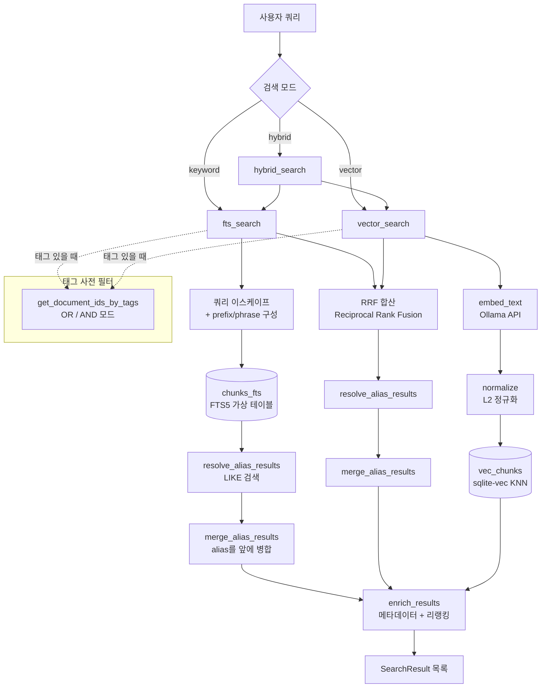
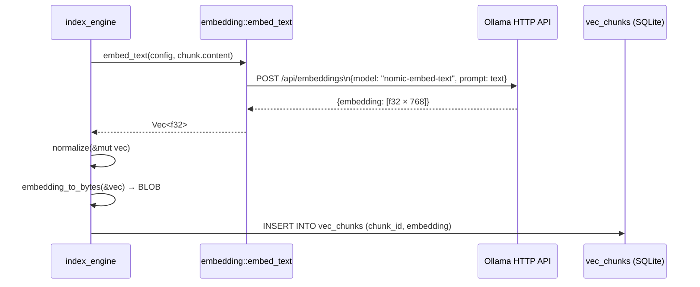
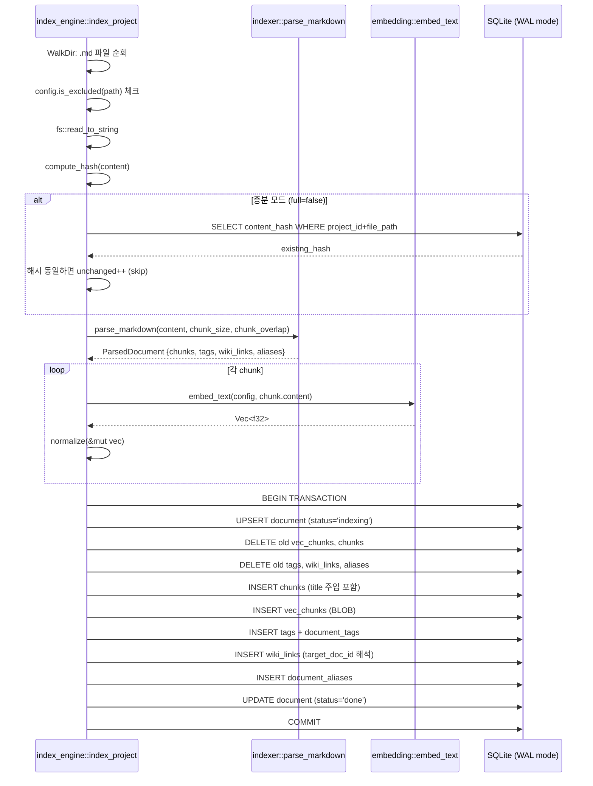

<!-- docsmith: auto-generated 2026-03-23 -->

# 검색 시스템 상세 분석

[[search-system.md|검색 시스템 개요]]가 "무엇을 하는가"를 설명한다면, 이 문서는 "어떻게 동작하는가"를 코드 레벨로 분석합니다.

## 검색 아키텍처 개요



모든 검색 경로는 `enrich_results`를 통해 tags, backlink_count, view_count를 붙이고 리랭킹합니다.

---

## 키워드 검색 (FTS5)

### FTS5 가상 테이블 구조

`V1__initial.sql`에서 정의:

```sql
CREATE VIRTUAL TABLE IF NOT EXISTS chunks_fts USING fts5(
    content,
    heading_path,
    content=chunks,          -- external content table
    content_rowid=rowid,
    tokenize='unicode61'
);
```

- `content=chunks` — 외부 콘텐츠 테이블 모드: 텍스트는 `chunks`에 저장, FTS5 인덱스는 별도 관리
- `tokenize='unicode61'` — Unicode 61 기반 토크나이저로 한국어/일본어 등 멀티바이트 문자 지원
- `heading_path` 컬럼도 인덱싱하여 섹션 경로 검색 가능

FTS5 동기화는 트리거로 자동 처리됩니다:

```sql
-- INSERT 시
CREATE TRIGGER chunks_ai AFTER INSERT ON chunks BEGIN
    INSERT INTO chunks_fts(rowid, content, heading_path)
    VALUES (new.rowid, new.content, new.heading_path);
END;

-- DELETE 시 (tombstone 패턴)
CREATE TRIGGER chunks_ad AFTER DELETE ON chunks BEGIN
    INSERT INTO chunks_fts(chunks_fts, rowid, content, heading_path)
    VALUES ('delete', old.rowid, old.content, old.heading_path);
END;
```

`'delete'` 명령을 FTS5에 삽입하는 외부 콘텐츠 테이블의 tombstone 패턴을 사용합니다.

### 쿼리 파싱 및 이스케이프

`search.rs`의 `fts_search` 함수가 raw 쿼리를 안전한 FTS5 표현식으로 변환합니다:

```
입력: wiki_links 검색
출력: "wiki_links" OR "wiki" OR "links"
```

단계별 처리 (코드 line 139-171):

1. **따옴표 이스케이프**: `"` → `""` (FTS5 문자열 리터럴 규칙)
2. **기본 구문 매칭**: 전체를 `"..."` 따옴표로 묶어 phrase match
3. **다중 단어 분해**: 공백으로 분리된 각 단어를 개별 `"..."` 항목으로 추가 (OR)
4. **밑줄 분해**: `_`를 기준으로 분리하여 `wiki_links` → `wiki`, `links` 추가 (OR)
5. **프리픽스 매칭**: 3자 이하 쿼리에만 `"..."*` 추가

결과 표현식: `"단어1" OR "단어2" OR "단어3"*`

### 짧은 쿼리 처리

```rust
// Short query: add prefix matching
if trimmed.chars().count() <= 3 {
    parts.push(format!("\"{}\"*", escaped));
}
```

주의: `chars().count()`를 사용하므로 한글 1자도 1로 계산됩니다. `"AI"`(2자)나 `"검색"`(2자) 모두 프리픽스 매칭이 적용됩니다.

### 프로젝트 필터에 따른 파라미터 바인딩

SQL은 런타임에 동적으로 구성됩니다. 파라미터 인덱스가 조건에 따라 달라집니다:

| 조건 | SQL 파라미터 순서 |
|------|-----------------|
| 기본 | `?1`=FTS쿼리, `?last`=limit |
| project_id 있음 | `?1`=FTS쿼리, `?2`=project_id, ..., `?last`=limit |
| tag 필터 있음 | `?1`=FTS쿼리, [project_id], tag_ids..., `?last`=limit |

파라미터는 `Vec<Box<dyn ToSql>>`에 순서대로 push하여 관리합니다:

```rust
params_boxed.push(Box::new(safe_query.clone()));
if let Some(pid) = project_id {
    params_boxed.push(Box::new(pid.to_string()));
}
if let Some(ref ids) = tag_doc_ids {
    for id in ids { params_boxed.push(Box::new(id.clone())); }
}
params_boxed.push(Box::new(limit as i64));
```

### FTS5 snippet 함수

```sql
snippet(chunks_fts, 0, '<b>', '</b>', '...', 64) as snippet
```

- `0`: content 컬럼 (인덱스 0)
- `'<b>', '</b>'`: 매칭 단어 강조 마커
- `'...'`: 앞뒤 생략 마커
- `64`: 토큰 최대 개수

---

## 벡터 검색 (sqlite-vec)

### 벡터 저장 구조

`V3__sqlite_vec` 마이그레이션에서 동적 생성:

```rust
conn.execute_batch(&format!(
    "CREATE VIRTUAL TABLE IF NOT EXISTS vec_chunks USING vec0(
        chunk_id TEXT PRIMARY KEY,
        embedding float[{dimensions}]
    );"
))?;
```

`dimensions`는 `config.embedding.dimensions`에서 읽습니다 (기본값 768, nomic-embed-text 기준).

벡터는 BLOB으로 직렬화되어 저장됩니다. `embedding_to_bytes`는 f32 배열을 little-endian으로 직렬화합니다:

```rust
pub fn embedding_to_bytes(embedding: &[f32]) -> Vec<u8> {
    embedding.iter().flat_map(|f| f.to_le_bytes()).collect()
}
```

768차원 벡터 = 768 × 4 bytes = 3,072 bytes per chunk.

### L2 정규화와 코사인 유사도 근사

저장 전 반드시 정규화합니다:

```rust
let mut vec = embed_text(config, &chunk.content)?;
normalize(&mut vec);  // L2 norm = 1.0으로 만들기
```

```rust
pub fn normalize(v: &mut [f32]) {
    let norm = v.iter().map(|x| x * x).sum::<f32>().sqrt();
    if norm > 0.0 { v.iter_mut().for_each(|x| *x /= norm); }
}
```

정규화된 벡터에서 L2 거리와 코사인 유사도의 관계:

```
L2_distance² = ||a - b||² = ||a||² + ||b||² - 2(a·b) = 2 - 2·cos(a,b)
따라서: cos(a,b) = 1 - L2_distance²/2
```

코드에서 그대로 반영:

```rust
let similarity = 1.0 - (distance * distance) / 2.0;
```

### KNN 쿼리 방식

sqlite-vec의 MATCH 문법:

```sql
SELECT v.chunk_id, v.distance, ...
FROM vec_chunks v
JOIN chunks c ON v.chunk_id = c.id
...
WHERE v.embedding MATCH ?1
  AND k = ?2
ORDER BY v.distance
```

`k = ?2`가 KNN의 K 값입니다. 태그 필터나 프로젝트 필터가 있을 경우 오버패칭 후 필터링합니다:

```rust
let fetch_limit = if tag_id_set.is_some() {
    limit * 5    // 태그 필터: 5배 오버패치
} else if project_id.is_some() {
    limit * 3    // 프로젝트 필터: 3배 오버패치
} else {
    limit        // 필터 없음: 정확히 K개
};
```

sqlite-vec는 SQL WHERE 절로 프로젝트 필터를 수행할 수 없기 때문에 Rust 레이어에서 후처리합니다.

### Ollama 임베딩 API 호출 흐름



HTTP 클라이언트는 `LazyLock`으로 초기화된 싱글톤을 재사용합니다 (`pool_max_idle_per_host=16`, timeout=30s). 임베딩 실패 시 `None`을 반환하고 해당 청크의 벡터 엔트리는 생략됩니다 (FTS5 검색에는 계속 포함).

---

## 하이브리드 검색 (RRF)

### Reciprocal Rank Fusion 알고리즘

두 결과 목록을 순위 기반으로 병합합니다:

```
RRF_score(chunk) = (1 - weight) × 1/(rank_fts + 60)
                 + weight       × 1/(rank_vec + 60)
```

- `60`은 RRF 표준 상수 (낮은 순위 결과의 점수 감소를 완화)
- `weight`는 벡터 쪽 가중치 (`config.search.hybrid_weight`)
- `(1 - weight)`는 키워드 쪽 가중치

코드 구현 (line 586-596):

```rust
for (rank, r) in keyword_results.iter().enumerate() {
    let rrf_score = (1.0 - weight) * (1.0 / (rank as f64 + 60.0));
    scores.entry(r.chunk_id.clone()).or_insert((0.0, r.clone())).0 += rrf_score;
}

for (rank, r) in vector_results.iter().enumerate() {
    let rrf_score = weight * (1.0 / (rank as f64 + 60.0));
    scores.entry(r.chunk_id.clone())
        .and_modify(|(s, _)| *s += rrf_score)
        .or_insert((rrf_score, r.clone()));
}
```

두 목록 모두에 등장하는 청크는 양쪽 점수를 합산하므로 자연스럽게 부스트됩니다.

### 쿼리 길이에 따른 동적 가중치

짧은 쿼리는 의미 검색보다 키워드 검색이 더 정확합니다:

```rust
let weight = if char_count <= 2 {
    config.search.hybrid_weight * 0.3   // 벡터 비중 30%로 축소
} else if char_count <= 4 {
    config.search.hybrid_weight * 0.6   // 벡터 비중 60%로 축소
} else {
    config.search.hybrid_weight         // 설정값 그대로 사용
};
```

`hybrid_weight=0.5` 기본값 기준:

| 쿼리 길이 | 실제 weight | 키워드 : 벡터 |
|-----------|------------|--------------|
| 1-2자 | 0.15 | 85 : 15 |
| 3-4자 | 0.30 | 70 : 30 |
| 5자 이상 | 0.50 | 50 : 50 |

### Ollama 장애 시 Graceful Fallback

```rust
let vector_results = match vector_search(...) {
    Ok(r) => r,
    Err(e) => {
        tracing::warn!("Vector search failed, falling back to keyword only: {}", e);
        return Ok(keyword_results.into_iter().take(limit).collect());
    }
};
```

벡터 검색 실패(Ollama 미실행 등) 시 키워드 결과만 반환합니다. 오류를 사용자에게 전파하지 않습니다.

---

## 리랭킹 로직

`enrich_results` 함수는 검색 결과에 메타데이터를 부착하고 점수를 조정합니다.

### 메타데이터 배치 조회

N+1 쿼리를 방지하기 위해 `IN (...)` 플레이스홀더로 배치 조회합니다:

```rust
let placeholders = doc_ids.iter().map(|_| "?").collect::<Vec<_>>().join(",");
// → "?, ?, ?, ..."
```

4개의 배치 쿼리를 순차 실행합니다:
1. tags: `document_tags JOIN tags WHERE document_id IN (...)`
2. backlink_count: `wiki_links WHERE target_doc_id IN (...) GROUP BY target_doc_id`
3. view_count: `document_views WHERE document_id IN (...) GROUP BY document_id`
4. document metadata: `documents WHERE id IN (...)` (title, last_modified)

### 점수 부스트 계산

모든 부스트는 곱셈 방식으로 적용됩니다:

```rust
r.score *= 1.0 + boost;
```

| 부스트 요소 | 조건 | 값 |
|------------|------|-----|
| 타이틀 매칭 | `heading_path` 최상위가 문서 title과 일치 | +0.10 |
| 헤딩 깊이 | `heading_path`에 ` > `가 없음 (최상위 섹션) | +0.05 |
| backlink_count | `use_popularity=true` | `min(bl × 0.02, 0.20)` |
| view_count | `use_popularity=true` AND `vc > 0` | `min(ln(vc+1) × 0.03, 0.15)` |

**인기도 적용 기준** (`use_popularity` 파라미터):
- 프로젝트 내 검색: 기본 `true`
- 전체(cross-project) 검색: 기본 `false`

view_count 부스트에 로그 함수를 사용하여 극단적인 조회수가 과도한 가중치를 갖지 않도록 합니다.

---

## Alias Fallback 메커니즘

### 동작 방식

FTS5/하이브리드 검색 결과와 별개로, `resolve_alias_results`는 항상 실행됩니다 (결과 수에 무관):

```rust
// fts_search 내부
let alias_results = {
    let raw = resolve_alias_results(&conn, trimmed, project_id, limit);
    if let Some(ref ids) = tag_doc_ids {
        raw.into_iter().filter(|r| ids.contains(&r.document_id)).collect()
    } else { raw }
};
let results = merge_alias_results(alias_results, results, limit);
```

### Alias LIKE 쿼리

```sql
SELECT c.id, c.document_id, d.file_path, p.name, c.heading_path,
       substr(c.content, 1, 200) as snippet, 0.0 as score
FROM document_aliases da
JOIN documents d ON da.document_id = d.id
JOIN chunks c ON c.document_id = d.id
JOIN projects p ON d.project_id = p.id
WHERE da.alias LIKE ?1   -- "%쿼리%"
GROUP BY c.document_id   -- 문서당 1개 청크만
LIMIT ?2
```

`LIKE "%쿼리%"` 패턴으로 부분 매칭을 수행합니다. `document_aliases` 테이블은 프론트매터의 `aliases` 필드에서 추출한 값을 저장합니다.

### 병합 우선순위

```rust
fn merge_alias_results(alias_results, main_results, limit) {
    // 1. alias 매칭 먼저 (중복 제거)
    for r in alias_results { if seen.insert(r.document_id) { merged.push(r); } }
    // 2. 나머지 FTS/벡터 결과
    for r in main_results { if merged.len() >= limit { break; } ... }
}
```

alias 매칭 결과는 항상 검색 결과 상단에 위치합니다. 중복 제거는 `document_id` 기준입니다.

**활용 예시**: `"데이터독"` 검색 → `datadog-setup.md` (본문 영문)가 alias "데이터독" 덕분에 상단에 노출.

---

## 인덱싱 파이프라인

### 전체 흐름



### 증분 인덱싱 변경 감지

SHA-256 해시 비교로 변경 여부를 판단합니다:

```rust
let new_hash = indexer::compute_hash(&content);  // SHA-256 hex
if !full {
    if let Some(existing_hash) = get_existing_hash(pool, &proj.id, &rel_path)? {
        if existing_hash == new_hash {
            report.unchanged += 1;
            continue;
        }
    }
}
```

`full=true`로 전달하면 해시 비교를 건너뛰고 모든 파일을 강제 재인덱싱합니다.

### 유령 문서(Ghost Document) 정리

인덱싱 완료 후 디스크에서 삭제된 문서를 DB에서 제거합니다:

```rust
for (doc_id, doc_path) in &all_docs {
    let abs = vault_path.join(doc_path);
    if !abs.exists() {
        conn.execute("DELETE FROM documents WHERE id = ?1", params![doc_id])?;
    }
}
```

ON DELETE CASCADE 제약으로 `chunks`, `document_tags`, `wiki_links`, `document_aliases`가 연쇄 삭제됩니다.

### 첫 번째 청크 타이틀 주입

FTS5가 파일명/타이틀로도 검색 가능하도록 첫 청크에 제목을 주입합니다:

```rust
let content = if i == 0 && !doc_title.is_empty() {
    format!("{} {}\n{}", doc_title, file_stem, chunk.content)
    // 예: "검색 시스템 검색 시스템\n본문..."
    //      (frontmatter title + 파일명 stem + 원본 내용)
} else {
    chunk.content.clone()
};
```

`file_stem`은 `file_path`에서 확장자 제거 + `-`를 공백으로 변환한 값입니다.

### 청킹 전략

```
섹션 분할 → chunk_size 초과 시 문장 단위 분할 → overlap 적용
```

1. `split_by_headings`: H1~H6 기준으로 섹션 분리, `heading_path`는 `"A > B > C"` 형태
2. 섹션이 `chunk_size`(기본 512자) 이하: 그대로 1개 청크
3. 초과 시: `split_sentences`로 `.!?\n` 구분, `chunk_overlap`(기본 50자) 문자 단위 오버랩

오버랩은 청크 경계에서 문맥이 끊기는 문제를 완화합니다. `chars().count()`로 멀티바이트 문자를 정확히 처리합니다.

### watch 모드

`index_engine`은 `indexing_queue` 테이블을 통해 파일 변경 이벤트를 처리합니다:

```sql
CREATE TABLE IF NOT EXISTS indexing_queue (
    id INTEGER PRIMARY KEY AUTOINCREMENT,
    project_id TEXT NOT NULL,
    file_path TEXT NOT NULL,
    event_type TEXT NOT NULL,  -- 'create', 'modify', 'delete', 'rename'
    old_path TEXT,             -- rename 시 이전 경로
    created_at DATETIME DEFAULT CURRENT_TIMESTAMP,
    processed_at DATETIME      -- NULL = 미처리
);
CREATE INDEX IF NOT EXISTS idx_queue_pending
    ON indexing_queue(processed_at) WHERE processed_at IS NULL;
```

부분 인덱스 `WHERE processed_at IS NULL`로 미처리 이벤트만 효율적으로 조회합니다.

---

## DB 설정 및 성능

### WAL 모드 + 커넥션 풀

모든 커넥션에 공통 PRAGMA 적용:

```rust
conn.execute_batch(
    "PRAGMA journal_mode=WAL;
     PRAGMA busy_timeout=5000;
     PRAGMA foreign_keys=ON;
     PRAGMA synchronous=NORMAL;"
)
```

- `WAL`: 읽기/쓰기 동시성 향상 (읽기가 쓰기를 블록하지 않음)
- `busy_timeout=5000`: 잠금 대기 최대 5초 (SQLITE_BUSY 오류 방지)
- `synchronous=NORMAL`: 성능과 안전성 균형 (FULL보다 빠르고 OFF보다 안전)

커넥션 풀: `r2d2` + `r2d2_sqlite`, `max_size=10`

### sqlite-vec 등록

sqlite-vec는 auto extension으로 전역 등록됩니다. `Once`로 최초 1회만 실행합니다:

```rust
static INIT: Once = Once::new();
INIT.call_once(|| {
    unsafe {
        rusqlite::ffi::sqlite3_auto_extension(Some(std::mem::transmute(
            sqlite_vec::sqlite3_vec_init as *const (),
        )));
    }
});
```

이후 생성되는 모든 커넥션에서 `vec0` 가상 테이블을 사용할 수 있습니다.

---

## 관련 문서

- [[search-system.md]]
- [[database-schema.md]]
- [[architecture.md]]
